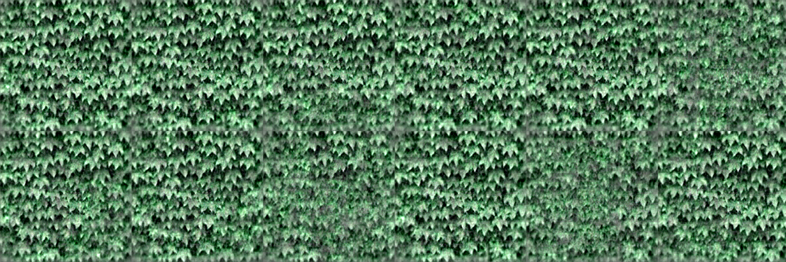
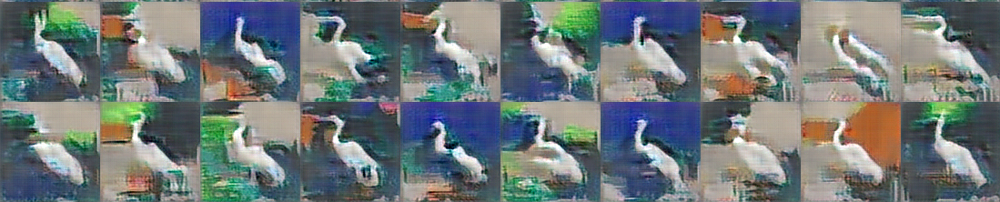
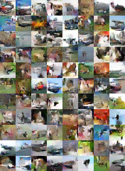
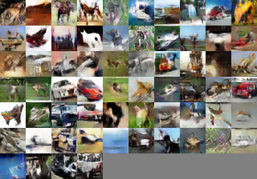
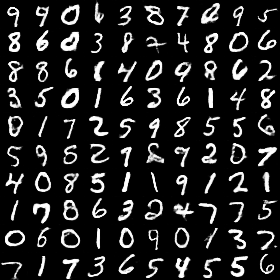
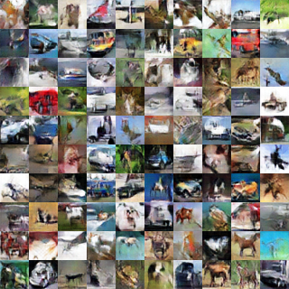
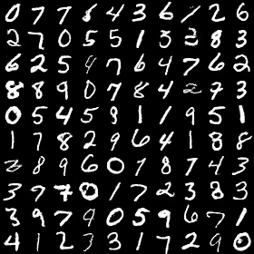
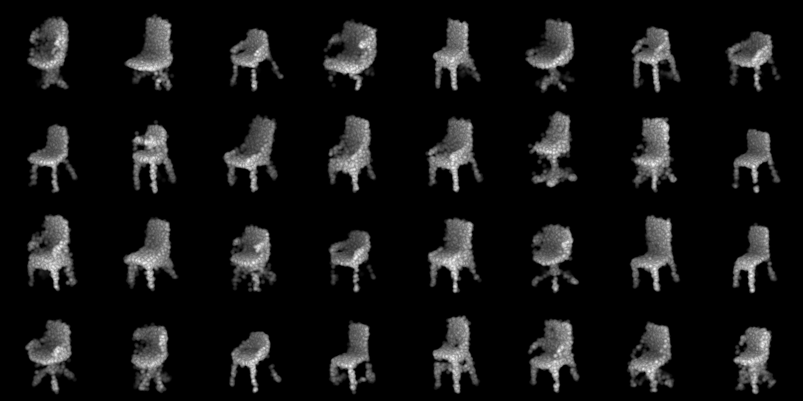
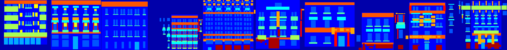
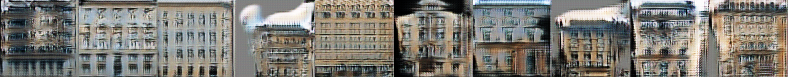

# PaddleEBM

This repository is a PaddlePaddle Library of Energy-based Models (EBMs).

## Prerequisites

- Linux or macOS
- Python 3.6+
- PaddlePaddle 2.0+

## Getting Started

- Clone this repo:

```bash
   git clone git@github.com:fei960922/PaddleEBM.git
   cd PaddleEBM
```

- Install Python dependencies by

```bash
   pip install -r requirements.txt
```

- Or by conda

```bash
   conda env create -f environment.yml
```

### Train different EBM models

- The general process for training a model is simply run `train.py` with a config file:

```bash
   python train.py --config-file configs/{$CONFIG_FILE}
```

- Currently, the following config is supported and tested.

|   | Paper               | Dataset      | Config Name             |  |
| - | ------------------- | ------------ | ----------------------- | - |
| 1 | EBM_warmstart       | texture      | ebm_ws_texture.yaml     |  |
|   |                     | egret        | ebm_ws_image.yaml       |  |
| 2 | EBM_shortrun        | cifar        | ebm_cifar.yaml          |  |
| 3 | CoopNet             | MNIST        | coopnets_mnist.yaml     |  |
|   |                     | cifar        | coopnets_cifar.yaml     |  |
| 4 | VAEBM               | MNIST        | coop_vaebm_mnist.yaml   |  |
| 5 | GVoxelNet           | ModelNet     | ebm_voxelnet.yaml       |  |
| 6 | GPointnet           | ModelNet     | ebm_gpointnet.yaml      |  |
| 7 | STGConvNet          | Single video | ebm_stgconvnet.yaml     |  |
| 8 | Conditional CoopNet | MNIST        | ccoopnet_mnist.yaml     |  |
|   |                     | CMP facade   | ccoopnet_cmpfacade.yaml |  |

- By default, the result will be in the folder: `output_dir/{$MODEL}-{$DATASET}-{$DATE}`
  - Image output will in `visual_train` folder.
  - Checkpoint will stored in the folder. Also, a log file will be stored.

### 1. EBM_warmstart

- Dataset texture and egret is provided at ???
- You have to first copy image(s) into: `data/{CATEGORY}`. You can change the data path in the config file.
- A sample output is provided below.




### 2. EBM_shortrun

- Dataset will be automatically downloaded to `data` folder.
- A sample output is provided below.



### 3. CoopNet

- Dataset will be automatically downloaded to `data` folder for both MNIST and cifar.
- A sample output is provided below.

  

### 4. CoopVAEBM

 

### 6. GPointNet

- Dataset texture and egret is provided at [here](http://www.stat.ucla.edu/~jxie/GPointNet/data/modelnet_2k.zip)
- You have to first copy image(s) into: `data/{CATEGORY}`. You can change the data path in the config file.
- A sample output is provided below.



### 8. Conditional CoopNet




<!-- #### GVoxelNet

pending, current no result saved on disk.


#### STGConvNet

pending, current no result saved on disk. -->

## Publication list

1. A Theory of Generative ConvNet [[Pdf](http://www.stat.ucla.edu/~ywu/GenerativeConvNet/doc/GConvNet.pdf)]
2. Learning Non-Convergent Non-Persistent Short-Run MCMC Toward Energy-Based Model [[Pdf](https://arxiv.org/pdf/1904.09770)]
3. Cooperative Training of Descriptor and Generator Networks. TPAMI 2018 [[Pdf](https://arxiv.org/pdf/1609.09408.pdf)]
4. Learning Energy-Based Model with Variational Auto-Encoder as Amortized Sampler. AAAI 2021 [[Pdf](https://arxiv.org/pdf/2012.14936.pdf)]
5. GVoxelNet: Generative VoxelNet: Learning Energy-Based Models for 3D Shape Synthesis and Analysis. TPAMI 2020 [[Pdf](https://arxiv.org/pdf/2012.13522.pdf)]
6. Generative PointNet: Deep Energy-Based Learning on Unordered Point Sets for 3D Generation, Reconstruction and Classification [[Pdf](https://arxiv.org/pdf/2004.01301.pdf)]
7. Learning Energy-based Spatial-Temporal Generative ConvNet for Dynamic Patterns [[Pdf](http://www.stat.ucla.edu/~jxie/personalpage_file/publications/STGConvNet_pami19.pdf)]
8. Cooperative Training of Fast Thinking Initializer and Slow Thinking Solver for Conditional Learning [[Pdf](http://www.stat.ucla.edu/~jxie/CCoopNets/CCoopNets_file/doc/CCoopNets.pdf)]

<!-- - Learning Cycle-Consistent Cooperative Networks via Alternating MCMC Teaching for Unsupervised Cross-Domain Translation. AAAI 2021 -->

## Acknowledgements

This repository is based on [PaddleGAN](https://github.com/PaddlePaddle/PaddleGAN) and [PaddlePaddle](https://github.com/PaddlePaddle/Paddle) official implementation.
