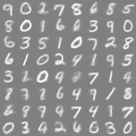

# Readme file for `<EBM with optimal transport>`

`OT_paddle.py` is a single file implemented EBM with ot by paddlepaddle.

## Getting Started

- Install Python dependencies by

```
pip install -r requirements.txt
```

- Train from stratch

```bash
python OT_paddle.py
```

- The result is saved by default in `$OUTPUT_DIR = $output_dir/OT_{setting, date}`
  - see log at `$OUTPUT_DIR/log.log`
  - parameter is saved each epoch at `$OUTPUT_DIR/models/OT_{$EPOCH}.pth`
  - see reconstructed image before optimal transport at `$OUTPUT_DIR/images/{$EPOCH}.png`
  - see reconstructed image afteroptimal transport at `$OUTPUT_DIR/images/warm_{$EPOCH}.png`
  - see generated image before optimal transport at `$OUTPUT_DIR/images/{$EPOCH}_gen.png`
  - see generated image after optimal transport at `$OUTPUT_DIR/images/warm_{$EPOCH}_gen.png`

## Sample results

A sample generation result for MNIST is shown below.


